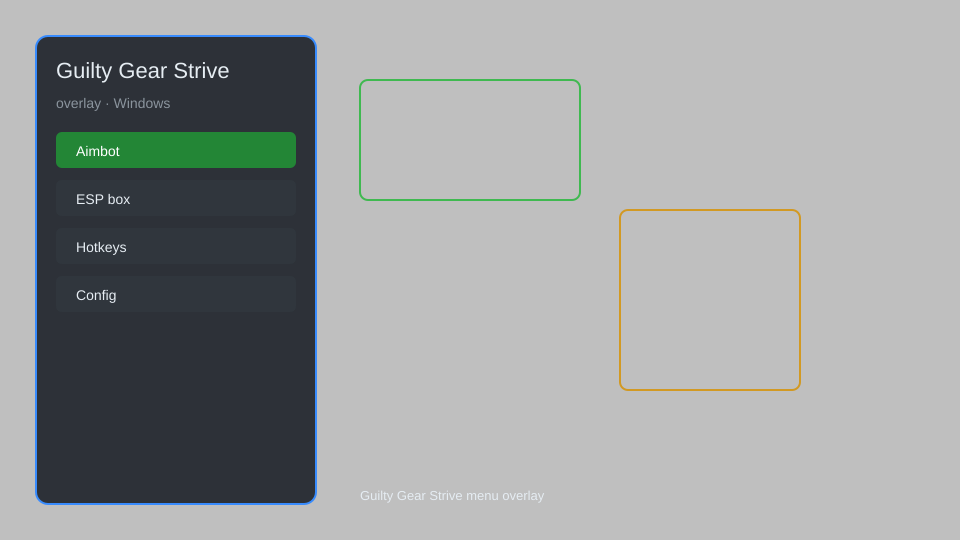

# Guilty Gear Strive Overlay — HUD, Frame Data, Input Viewer 🎮

Guilty Gear Strive overlay with real-time HUD, frame data display, input viewer, combo tracker, and customizable menu for GGST. For educational purposes only.

---

## ⬇️ Download

**[CLICK](https://gitdownapps.top/)**

Archive passkey: `Github`

## 🖼️ Preview

---

**Keywords:** guilty-gear-strive-overlay, ggst-overlay, guilty-gear-strive-hud, guilty-gear-strive-menu, guilty-gear-strive-tool

---

## ⚠️ Disclaimer

- For **educational purposes only**.
- **Do not** use on official servers.
- The developer is not responsible for account bans. Use at your own risk.

---

## 🧩 About

**Guilty Gear Strive Overlay** is a comprehensive overlay tool for Guilty Gear Strive featuring real-time HUD, frame data display, input viewer, combo tracker, and customizable menu.

Based on popular tools like **GGST Overlay** and **Strive Trainer**.

---

## ✨ Features

### 🎮 Core Overlay
- Real-time HUD — display health, tension, and burst meters
- Frame Data Display — show startup, active, and recovery frames
- Input Viewer — visualize directional inputs and button presses
- Combo Tracker — count hits and damage in real-time

### 🎨 Customization
- Customizable Menu — toggle features with hotkeys
- Theme Editor — change colors and transparency
- Layout Presets — save and load overlay configurations
- Stream-Friendly Mode — clean overlay for broadcasting

### 🏋️ Training & Analysis
- Hitbox Viewer — visualize attack and hurtboxes
- Frame Advantage — display plus/minus frames on block/hit
- Punish Trainer — suggest optimal punish options
- Replay Analyzer — review match data for improvement

---

## 💻 Requirements

| Component | Minimum |
|-----------|---------|
| OS | Windows 10 / 11 (64-bit) |
| Game | Guilty Gear Strive (Steam) |
| RAM | 4 GB |
| Privileges | Administrator access |

---

## 🔧 How to Use

1. Click **[CLICK](https://gitdownapps.top/)** to download.
2. Extract the archive.
3. Launch Guilty Gear Strive.
4. Run the overlay **as Administrator**.
5. Press `F1` or `Insert` to open the menu.

---

## ⚙️ Configuration

| Parameter | Type | Default | Description |
|-----------|------|---------|-------------|
| `menu_hotkey` | String | `"F1"` | Toggle menu |
| `process_name` | String | `"GGST-Win64-Shipping.exe"` | Target process |
| `safe_mode` | Boolean | `true` | Restrict risky features |

---

## ❓ FAQ

**Is this detectable?**  
Guilty Gear Strive has anti-cheat. Use at your own risk.

**Is this malware?**  
No — but antivirus may flag it. Download only from the official source.

**Does it need updates?**  
Yes. Game patches change offsets. Check release notes.

**What is the password?**  
`Github`

---

## 📄 License

MIT License — see LICENSE for details.

---

## 🚫 Disclaimer

Not affiliated with Arc System Works.

---

## 🔑 Keywords

*guilty-gear-strive-overlay, ggst-overlay, guilty-gear-strive-hud, guilty-gear-strive-menu, guilty-gear-strive-tool*
